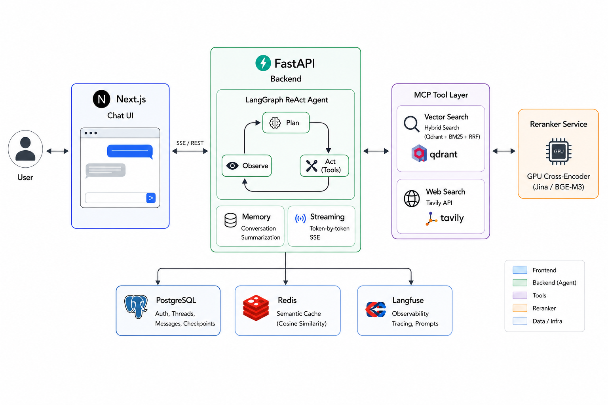

# RAG Agent System

A production-grade **Retrieval-Augmented Generation (RAG)** system featuring a ReAct agent loop, hybrid vector search, semantic caching, and real-time streaming. Built with **FastAPI**, **LangGraph**, and **Next.js**, deployed via **Docker Compose**.

[](https://python.org)
[](https://fastapi.tiangolo.com)
[](https://nextjs.org)
[](https://langchain-ai.github.io/langgraph)
[](https://docs.docker.com/compose)

---

## Demo

> ▶️ [Watch demo video](#)

---

## Overview

This system answers user queries by orchestrating multiple retrieval tools through a ReAct agent loop, reranking collected documents with a GPU-accelerated cross-encoder, and generating streaming responses grounded in retrieved context.

### Key capabilities

- **Hybrid retrieval** — Qdrant dense + BM25 sparse vectors fused via Reciprocal Rank Fusion (RRF)
- **ReAct agent** — iterative tool-calling loop (vector search + web search) via LangGraph StateGraph
- **GPU reranker** — standalone cross-encoder microservice (Jina / BGE-M3) filters low-relevance documents before generation
- **Semantic cache** — Redis-backed cosine similarity cache (threshold 0.92) short-circuits the pipeline on near-duplicate queries
- **Streaming** — token-by-token SSE output with real-time agent status events
- **Conversation memory** — sliding-window summarization maintains long-running multi-turn context within token budget
- **Full auth** — JWT access + refresh token rotation, bcrypt password hashing, guest mode support
- **Observability** — Langfuse span-level tracing for every LLM call

---

## Architecture



### Request flow

```
User Query
   │
   ▼
Semantic Cache ──hit──▶ Return cached answer
   │ miss
   ▼
ReAct Agent Loop (LangGraph)
   ├──▶ MCP Vector Search (Qdrant hybrid)
   └──▶ MCP Web Search (Tavily)
   │
   ▼
Reranker Service (GPU cross-encoder)
   │
   ▼
Generation — Gemini 2.5 Flash (streaming)
   │
   ▼
Post-turn: summarize history · store cache
```

---

## Tech Stack

| Layer | Technology |
|---|---|
| **Frontend** | Next.js 15, TypeScript, Tailwind CSS |
| **Backend** | Python 3.11+, FastAPI, Uvicorn |
| **Agent** | LangGraph StateGraph, LangChain |
| **LLM** | Google Gemini 2.5 Flash |
| **Embeddings** | Gemini Embedding 001 (3072-dim) |
| **Vector DB** | Qdrant v1.9.2 (dense + sparse BM25) |
| **Relational DB** | PostgreSQL 16 (async psycopg3) |
| **Cache** | Redis 7 (semantic cosine similarity) |
| **Reranker** | GPU microservice — Jina / BGE-M3 cross-encoder |
| **Tool Protocol** | MCP (Model Context Protocol, streamable HTTP) |
| **Web Search** | Tavily API |
| **Auth** | JWT access + refresh token rotation, bcrypt |
| **Observability** | Langfuse (span tracing, prompt management) |
| **Deployment** | Docker Compose |

---

## Project Structure

```
rag-agent-system/
├── backend/
│   ├── agent/
│   │   ├── agent.py               # ReAct node — tool loop + reranking
│   │   ├── graph.py               # LangGraph StateGraph + PostgreSQL checkpointer
│   │   ├── nodes.py               # process_history, generate, cleanup nodes
│   │   ├── runner.py              # Streaming runner — Langfuse + semantic cache
│   │   ├── conversation.py        # Token-budgeted history + summarization
│   │   └── inference_clients.py   # Reranker HTTP client
│   ├── core/
│   │   ├── db.py                  # Async PostgreSQL connection pool
│   │   └── security.py            # JWT, bcrypt password hashing
│   ├── routers/
│   │   ├── auth.py                # register · login · refresh · logout · me
│   │   └── chat.py                # create thread · send message (SSE) · list threads
│   ├── crud/
│   │   ├── user.py                # User CRUD
│   │   ├── token.py               # Refresh token CRUD
│   │   └── thread.py              # Thread & message persistence
│   ├── langfuse_client/           # Langfuse singleton, callback handler, prompts
│   ├── redis_modules/             # Semantic cache (cosine similarity)
│   ├── dependencies.py            # FastAPI dependency injection
│   ├── main.py                    # FastAPI app, lifespan, routers
│   ├── schemas.py                 # Pydantic request/response models
│   └── state.py                   # AgentState TypedDict (LangGraph)
├── frontend/
│   ├── src/app/                   # Next.js App Router pages (chat, login, register)
│   ├── src/components/            # Chat UI, sidebar, message bubbles, input
│   ├── src/hooks/                 # useAuth, useChat (streaming state)
│   └── src/lib/api.ts             # API client with auto token refresh
├── mcp_server/
│   ├── vector_search.py           # Hybrid Qdrant search (dense + BM25 + RRF)
│   └── web_search.py              # Tavily web search + chunking
├── services/reranker/             # Cross-encoder reranker microservice (GPU)
├── training/                      # Reranker fine-tuning pipelines (Jina, BGE-M3)
├── ingest.py                      # Document ingestion (PDF/TXT → Qdrant)
├── docker-compose.yaml            # Development
└── docker-compose.prod.yaml       # Production (healthchecks, build contexts)
```

---

## Getting Started

### Prerequisites

- Docker & Docker Compose
- Google Gemini API key
- Tavily API key
- Langfuse keys (optional)
- NVIDIA GPU (optional, for reranker)

### Environment variables

```bash
cp .env.example .env
# Fill in:
GEMINI_API_KEY=
SECRET_KEY=
TAVILY_API_KEY=
LANGFUSE_PUBLIC_KEY=    # optional
LANGFUSE_SECRET_KEY=    # optional
```

### Run

```bash
# Start all services
docker compose -f docker-compose.yaml up --build

# Ingest documents
python ingest.py --source ./docs --collection rag_documentations

# Start reranker (requires NVIDIA GPU)
docker compose -f docker-compose.yaml --profile gpu up -d reranker
```

Open `http://localhost:3000`.

---

## API Reference

### Auth

```
POST /auth/register
POST /auth/login
POST /auth/refresh
POST /auth/logout
GET  /auth/me
```

### Chat

```
POST /threads
GET  /threads
GET  /threads/{thread_id}/messages
POST /threads/{thread_id}/messages   ← SSE streaming
```

#### SSE event types

| Type | Description |
|---|---|
| `status` | Agent status (searching, reranking, generating) |
| `token` | Streaming generation token |
| `cache_hit` | Semantic cache hit — full answer returned immediately |

---

## Design Decisions

**LangGraph StateGraph** — explicit node transitions with built-in PostgreSQL checkpointing enable persistent multi-session conversations and straightforward streaming via `graph.astream()`.

**MCP for tool abstraction** — retrieval tools are self-contained HTTP microservices, making it trivial to add new data sources without modifying the agent core.

**Separate reranker service** — isolates GPU model loading from the main API, preventing OOM interference and allowing independent scaling.

**Semantic cache** — cosine similarity matching catches near-duplicate queries without exact string matching, significantly reducing LLM cost for repeated question patterns.

**Sliding-window summarization** — older conversation turns are compressed by the LLM while recent messages are preserved verbatim, balancing context quality with token efficiency.

---

## License

MIT